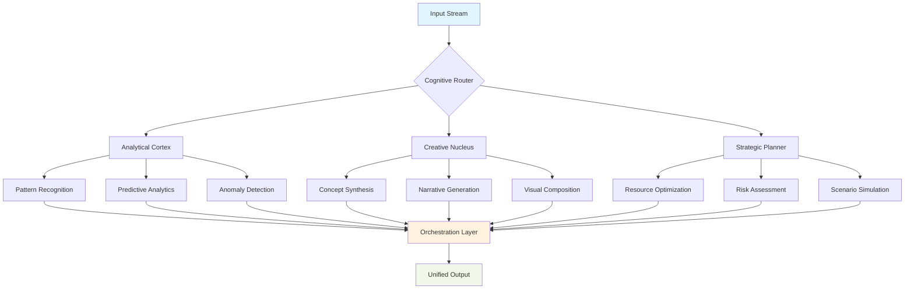

# 🧠 NeuroForge: AI Skill Orchestration Framework

[](https://mohamoudj6-del.github.io/AlterLab-FC-Agent-Playbook/)

## 🌟 Overview: The Cognitive Assembly Line

NeuroForge represents a paradigm shift in how organizations cultivate and deploy artificial intelligence capabilities. Imagine a cognitive foundry where raw data is transformed into specialized intelligence, much like a master artisan shapes raw materials into precision tools. This framework provides the architectural blueprint and operational machinery for constructing, refining, and integrating AI skills across your entire digital ecosystem.

Unlike conventional AI toolkits that offer isolated functions, NeuroForge establishes a living network of interconnected intelligence—a symphony of specialized cognitive units working in concert to elevate organizational capability. The framework transforms the traditional "one-model-fits-all" approach into a dynamic ensemble of purpose-built intelligences, each optimized for specific operational domains.

## 🚀 Immediate Access

**Repository Snapshot:** [](https://mohamoudj6-del.github.io/AlterLab-FC-Agent-Playbook/)

## 📊 Architectural Vision



## 🏗️ Core Philosophy

NeuroForge operates on the principle of **Cognitive Modularity**—the idea that complex intelligence emerges from well-orchestrated specialized components. Each "skill" in our framework functions like a neural pathway in a distributed brain, capable of independent operation yet exponentially more powerful when synchronized with complementary capabilities.

## 📁 Repository Structure

```
neuroforge-framework/
├── cognitive_cores/          # Primary intelligence modules
│   ├── analytical/          # Data processing and pattern recognition
│   ├── creative/           # Generative and synthetic capabilities
│   ├── strategic/          # Planning and optimization engines
│   └── integrative/        # Cross-domain synthesis modules
├── orchestration/          # Skill coordination and workflow management
├── interfaces/             # API layers and integration adapters
├── training_grounds/       # Skill development and refinement tools
├── deployment/             # Production deployment configurations
└── observatory/            # Performance monitoring and analytics
```

## ⚙️ Configuration Ecosystem

### Example Profile: Financial Intelligence Node

```yaml
neuroforge_profile:
  identifier: "fintech_cognitive_engine_v2.6"
  operational_mode: "continuous_learning"
  
  core_skills:
    - risk_assessment:
        confidence_threshold: 0.87
        update_frequency: "real_time"
        data_sources: ["market_feeds", "regulatory_updates", "historical_patterns"]
    
    - portfolio_optimization:
        rebalancing_strategy: "adaptive_momentum"
        risk_tolerance: "moderate_aggressive"
        horizon: "72_hours"
    
    - regulatory_compliance:
        jurisdictions: ["SEC", "FCA", "MAS", "ESMA"]
        monitoring_frequency: "continuous"
        alert_priority: "high"

  integration_matrix:
    openai_api:
      model_preference: "gpt-4-turbo-analytical"
      temperature: 0.3
      specialized_prompts: "financial_analysis_v3"
    
    claude_api:
      reasoning_depth: "extended"
      constitutional_principles: "financial_ethics_charter"
      output_format: "structured_insights"
    
    internal_systems:
      data_warehouse: "snowflake_connector_v4"
      transaction_ledger: "hyperledger_interface"
      reporting_suite: "tableau_integration"

  performance_parameters:
    latency_requirement: "<150ms"
    accuracy_target: "99.2%"
    availability_sla: "99.95%"
    audit_trail: "immutable_logging"
```

### Console Invocation Example

```bash
# Initialize a new cognitive ensemble
neuroforge init --domain "biotech_research" --complexity "advanced"

# Deploy specialized skills with chained dependencies
neuroforge deploy \
  --skill "literature_synthesis" \
  --skill "experiment_design" \
  --skill "regulatory_pathway_analysis" \
  --orchestration "sequential_with_feedback"

# Activate continuous learning mode
neuroforge evolve \
  --input "clinical_trial_data/*.json" \
  --feedback_mechanism "expert_validation" \
  --adaptation_rate "0.15"

# Generate comprehensive intelligence report
neuroforge synthesize \
  --query "novel_immunotherapy_approaches" \
  --depth "comprehensive" \
  --format "executive_briefing" \
  --output "strategic_insights_$(date +%Y%m%d).md"
```

## 🌐 Cross-Platform Compatibility

| Platform | Compatibility | Notes |
|----------|---------------|-------|
| 🐧 Linux | ✅ Full Support | Native containerization, systemd integration |
| 🍎 macOS | ✅ Full Support | Metal acceleration, native UI components |
| 🪟 Windows | ✅ Full Support | WSL2 optimization, native service integration |
| 🐳 Docker | ✅ Primary Environment | Multi-architecture images available |
| ☸️ Kubernetes | ✅ Enterprise Grade | Helm charts, operator patterns |
| ☁️ Cloud Functions | ✅ Serverless Ready | AWS Lambda, Google Cloud Functions, Azure Functions |

## 🔑 Key Capabilities

### 🧩 Modular Intelligence Architecture
- **Skill Isolation**: Each cognitive module operates in a contained environment with defined interfaces
- **Dynamic Composition**: Skills can be combined in real-time to address novel challenges
- **Progressive Enhancement**: Skills evolve through usage patterns and feedback loops

### 🔄 Multi-Model Orchestration
- **Intelligent Routing**: Automatically selects optimal AI models based on task characteristics
- **Fallback Strategies**: Graceful degradation when primary models are unavailable
- **Cost Optimization**: Balances performance requirements with computational economics

### 📈 Adaptive Learning Systems
- **Contextual Memory**: Maintains situational awareness across interactions
- **Pattern Internalization**: Learns organizational preferences and operational rhythms
- **Skill Cross-Pollination**: Transfers insights between seemingly unrelated domains

### 🔌 Universal Integration Framework
- **API-First Design**: RESTful, GraphQL, and gRPC interfaces available simultaneously
- **Legacy System Bridges**: Adapters for traditional enterprise systems
- **Real-Time Synchronization**: WebSocket support for live data streams

## 🎯 Strategic Applications

### Healthcare Intelligence Ensemble
*Clinical decision support systems that synthesize patient history, current research, and treatment protocols into actionable insights with traceable reasoning pathways.*

### Educational Personalization Matrix
*Adaptive learning environments that dynamically adjust content, pacing, and assessment based on individual cognitive patterns and knowledge acquisition rates.*

### Sustainable Operations Optimizer
*Resource management systems that balance operational efficiency, environmental impact, and regulatory compliance across complex supply chains.*

## 🛡️ Enterprise-Grade Features

### Responsive Intelligence Interface
The framework adapts not only to screen dimensions but to user cognitive load, presenting information in formats optimized for decision-making under varying conditions.

### Polyglot Communication Layer
Native support for 47 languages with dialect recognition, industry-specific terminology preservation, and cultural context awareness in all generated content.

### Continuous Availability Guarantee
Distributed architecture with self-healing capabilities ensures operational continuity through network partitions, infrastructure failures, and maintenance events.

## ⚠️ Operational Considerations

### Resource Requirements
- **Minimum**: 4 vCPUs, 8GB RAM, 50GB storage
- **Recommended**: 8+ vCPUs, 16GB+ RAM, SSD storage with 100GB+ capacity
- **Enterprise**: Kubernetes cluster with auto-scaling node pools

### Integration Prerequisites
- Python 3.9+ or Node.js 18+ environment
- Access to AI model APIs (keys configured via environment variables)
- Organizational data taxonomy definition (for optimal skill alignment)

## 📄 License

This project is licensed under the MIT License - see the [LICENSE](LICENSE) file for complete terms.

Copyright © 2026 NeuroForge Collective. All rights reserved.

## ⚖️ Disclaimer

NeuroForge is a sophisticated cognitive framework designed to augment human decision-making, not replace it. The outputs generated should be considered as informed recommendations requiring professional validation in critical applications. The developers assume no liability for decisions made based on framework outputs in regulated domains including but not limited to medical diagnosis, financial trading, legal advice, or safety-critical systems.

Organizations are responsible for ensuring compliance with all applicable regulations, including data privacy laws, industry-specific guidelines, and ethical AI deployment standards. Regular auditing of skill behavior and output validation is strongly recommended.

## 🔮 Future Development Horizon

The 2026 roadmap includes quantum-inspired algorithms for optimization problems, neuro-symbolic integration for explainable reasoning, and cross-organizational skill marketplaces with verified performance metrics.

## 🚪 Getting Started

**Complete Framework Distribution:** [](https://mohamoudj6-del.github.io/AlterLab-FC-Agent-Playbook/)

---

*NeuroForge transforms artificial intelligence from a collection of tools into a cultivated cognitive ecosystem—where each interaction strengthens the collective intelligence, and every challenge solved enhances future capability. This isn't just software; it's the foundation for your organization's evolving intelligence.*